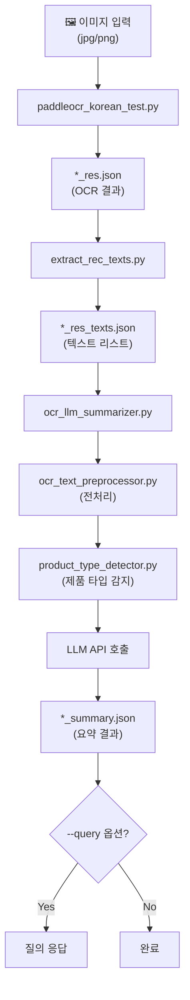

# OCR Text Processors

OCR로 추출된 텍스트를 처리하고 LLM을 통해 요약하는 파이프라인입니다.

---

## 📊 전체 프로세스 흐름



**간략 흐름:**
```
이미지 → OCR → 텍스트 추출 → 전처리 → 타입 감지 → LLM 요약 → JSON 저장
```

---

## 📁 파일 구조

| 파일명 | 역할 | 입력 | 출력 |
|--------|------|------|------|
| `paddleocr_korean_test.py` | 이미지에서 텍스트 추출 (OCR) | 이미지 파일 | `*_res.json` |
| `extract_rec_texts.py` | OCR 결과에서 텍스트만 추출 | `*_res.json` | `*_res_texts.json` |
| `ocr_text_preprocessor.py` | 노이즈 제거, 신뢰도 필터링 | 텍스트 리스트 | 정제된 텍스트 |
| `product_type_detector.py` | 제품 타입 감지 (식품/화장품 등) | 텍스트 리스트 | `ProductType` Enum |
| `ocr_llm_summarizer.py` | LLM으로 핵심 정보 요약 | `*_res_texts.json` | `*_summary.json` |

---

## 🚀 실행 방법

### Step 1. OCR 실행 (이미지 → 텍스트)

```bash
python paddleocr_korean_test.py
```

- **입력**: `../tests/fixtures/<이미지>.jpg`
- **출력**: `output/<이미지>_res.json`, `output/vis_<이미지>.jpg`

### Step 2. 텍스트 추출 (JSON → 텍스트 리스트)

```bash
python extract_rec_texts.py --input output/<이미지>_res.json
```

- **입력**: `output/<이미지>_res.json`
- **출력**: `output/<이미지>_res_texts.json`

### Step 3. LLM 요약 (텍스트 → 정보 요약)

```bash
python ocr_llm_summarizer.py --input output/<이미지>_res_texts.json
```

- **입력**: `output/<이미지>_res_texts.json`
- **출력**: `output/<이미지>_texts_summary.json`

### Step 4. 요약 정보 질의 (선택)

```bash
python ocr_llm_summarizer.py --output output/<이미지>_texts_summary.json --query "가격이 얼마야?"
```

---

## ⚙️ 환경 설정

### 가상환경 설정

```bash
# 가상환경 생성
python -m venv venv

# 가상환경 활성화 (Windows)
venv\Scripts\activate

# 가상환경 활성화 (Linux/Mac)
source venv/bin/activate
```

### 환경변수 (.env) 설정

`.env` 파일을 생성하고 아래 내용을 설정합니다:

```env
GMS_KEY=your_google_gemini_api_key_here
```

### 의존성 설치

```bash
# PaddlePaddle (CUDA 11.8)
python -m pip install paddlepaddle-gpu==3.0.0 -i https://www.paddlepaddle.org.cn/packages/stable/cu118/

# PaddlePaddle (CPU)
python -m pip install paddlepaddle==3.0.0 -i https://www.paddlepaddle.org.cn/packages/stable/cpu/

# PaddleOCR
python -m pip install paddleocr

# 기타 의존성
pip install requests python-dotenv
```

---

## 📂 출력 폴더 구조

```
output/
├── 초코파이_detail_res.json       # OCR 원본 결과
├── 초코파이_detail_res_texts.json # 추출된 텍스트 리스트
├── 초코파이_texts_summary.json    # LLM 요약 결과
└── vis_초코파이_detail.jpg        # OCR 시각화 이미지
```
